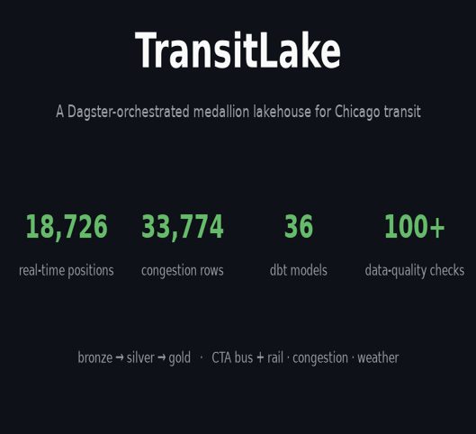

# 🚆 TransitLake

[](https://transitlake.vercel.app)
[](https://github.com/Archit1706/transit-lake/actions/workflows/ci.yml)

**Live demo → [transitlake.vercel.app](https://transitlake.vercel.app)** — the gold
marts queried in your browser with DuckDB-WASM.

A **Dagster-orchestrated medallion lakehouse** over Chicago multi-modal transit
data. It ingests daily **GTFS** + live real-time vehicle positions (CTA **bus**
via the BusTime JSON API, **rail** normalized to **GTFS-Realtime protobuf**) +
road **congestion** + **weather**, conforms them across modes, models them into
**dbt** dims/facts/marts on **DuckDB**, and enforces **100+ data-quality checks**
across bronze→silver→gold. A Streamlit dashboard surfaces on-time performance,
congestion hotspots, and delay↔weather/congestion analyses.

> Built on a Chicago transit / GTFS domain background — so the gold marts don't
> just move data, they **answer transportation questions**.



> Preview frames are generated from the live marts via
> [`scripts/make_dashboard_gif.py`](scripts/make_dashboard_gif.py); the interactive
> app is `dashboard/app.py`.

## Architecture

```
  Dagster (assets · schedules · sensors · asset checks)
        │
  ┌─────▼──────────────────────────────────────────────────────────────┐
  │ BRONZE (raw, immutable, dated partitions)                           │
  │   cta/gtfs_static · cta/gtfs_rt/vehicle_positions (bus JSON)        │
  │   cta/train_tracker (rail JSON) · cta/gtfs_rt/train_positions_pb    │
  │   (rail GTFS-RT protobuf) · socrata/{congestion,adt} · open_meteo   │
  ├─────────────────────────────────────────────────────────────────────┤
  │ SILVER (conformed)  typecast · dedupe · decode rail GTFS-RT protobuf │
  │   (gtfs-realtime-bindings) · bus+train unified positions            │
  ├─────────────────────────────────────────────────────────────────────┤
  │ GOLD (dbt)  dim_* · fact_* · mart_* (OTP, hotspots, delay↔weather)  │
  └─────────────────────────────────────────────────────────────────────┘
        │                          │                          │
  Great Expectations         dbt tests                  Streamlit
  (bronze→silver gates)   (in-warehouse, 90+)            dashboard
```

The lake is **Parquet on disk**; **DuckDB** is the query engine; **dbt-duckdb**
does the modeling. The dbt models load into the **same Dagster asset graph** via
`dagster-dbt`, so bronze→silver→staging→marts lineage (and dbt tests as asset
checks) all show in one UI. Zero-cost, fully local.

## Tech stack

| Layer | Tool |
| --- | --- |
| Orchestration | Dagster (software-defined assets incl. dbt models via `dagster-dbt`, schedules, **asset checks**) |
| Lake / engine | Parquet + DuckDB |
| Transformation | dbt (dbt-duckdb) — staging → intermediate → marts |
| Ingestion | Python + `requests`, `sodapy`, BusTime/Train Tracker APIs, `gtfs-realtime-bindings` (rail protobuf) |
| Data quality | Great Expectations (ingest) + dbt tests (warehouse) + Dagster asset checks |
| Dashboard | Streamlit + Plotly (Python) · **Next.js + DuckDB-WASM** (in-browser SQL) on Vercel |
| CI | GitHub Actions — ruff, sqlfluff, dagster validate, `dbt build` |

## Quickstart

```bash
# 1. Install (uv)
uv sync --extra dev --extra dashboard

# 2. Add API keys
cp .env.example .env   # fill in CTA Bus + Train keys

# 3. Backfill keyless sources
uv run python -m ingestion.gtfs_static     # CTA static GTFS  → bronze
uv run python -m ingestion.weather         # 2yr daily weather
uv run python -m ingestion.socrata         # congestion slice + ADT

# 4. Start the real-time poller (the volume driver — run it continuously)
uv run python -m ingestion.poller          # bus + train every 120s

# 5. Orchestrate (asset graph, schedules, checks)
uv run dagster dev

# 6. Build + test the warehouse
uv run dbt build --profiles-dir dbt --project-dir dbt

# 7. Dashboard
uv run streamlit run dashboard/app.py
```

## Data quality

Two-layer enforcement, **100+ checks**:

- **Great Expectations** suites on bronze/silver (`ingestion/quality.py`)
- **Dagster asset checks** — native DuckDB assertions + GE-backed, some `blocking`
- **dbt tests** — `not_null`, `unique`, `relationships` (facts→dims),
  `accepted_values`, and custom `in_range` (90+ tests)

Demo the failure mode — a bad row trips a blocking check and would halt the run:

```bash
uv run python -m scripts.demo_failing_check
```

## Project metrics

| Metric | Value |
| --- | --- |
| Sources / agencies | 6 sources · CTA bus + rail |
| dbt models | 36 (7 staging · 5 intermediate · 6 dim · 4 fact · 14 mart) |
| Data-quality checks | 100+ (90+ dbt tests · 12 Dagster asset checks · GE suites) |
| Rows | 5.8M static stop_times + ~1M/day real-time, accumulating |

## Docs

- [Data sources & keys](docs/sources.md)
- [Data dictionary](docs/data_dictionary.md)
- [Deploying the dashboard free](docs/DEPLOY.md)
- [Original build spec](docs/build_spec.md)

## Repo layout

```
ingestion/      # source clients (gtfs_static, gtfs_rt, gtfs_rt_protobuf, socrata, weather, quality, poller)
dagster_proj/   # assets (bronze, silver), dbt integration, resources, schedules, checks, definitions
dbt/            # models (staging/intermediate/marts), macros, tests, profiles
dashboard/      # Streamlit app (+ committed marts snapshot)
frontend/       # Next.js app — queries marts Parquet in-browser via DuckDB-WASM (Vercel)
scripts/        # CI bootstrap · backfills · marts exports (snapshot + parquet) · GIF · demo
lake/           # bronze/ silver/ + transitlake.duckdb  (gitignored)
```
